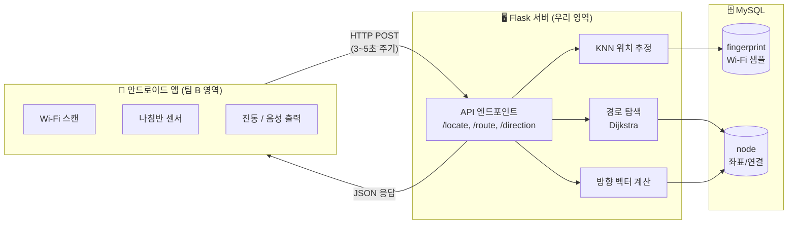
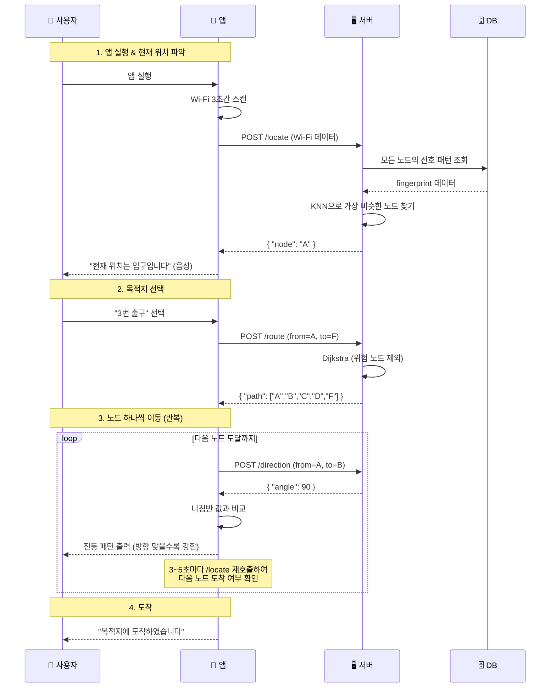
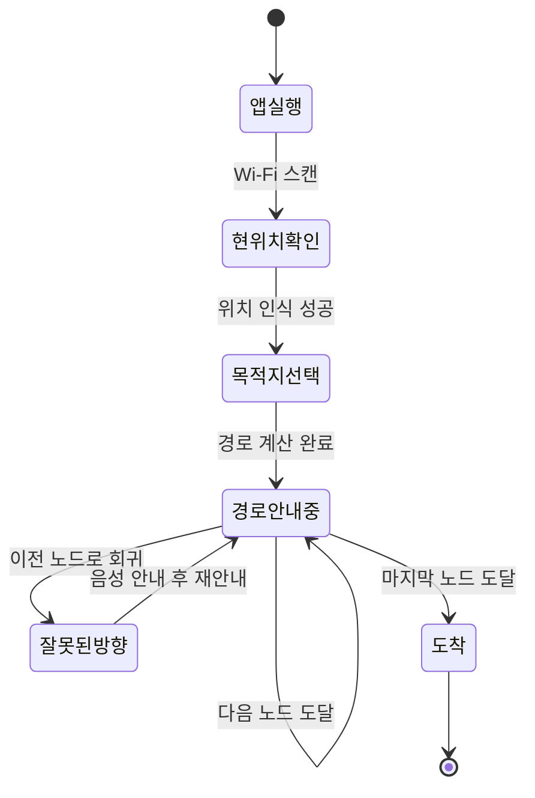
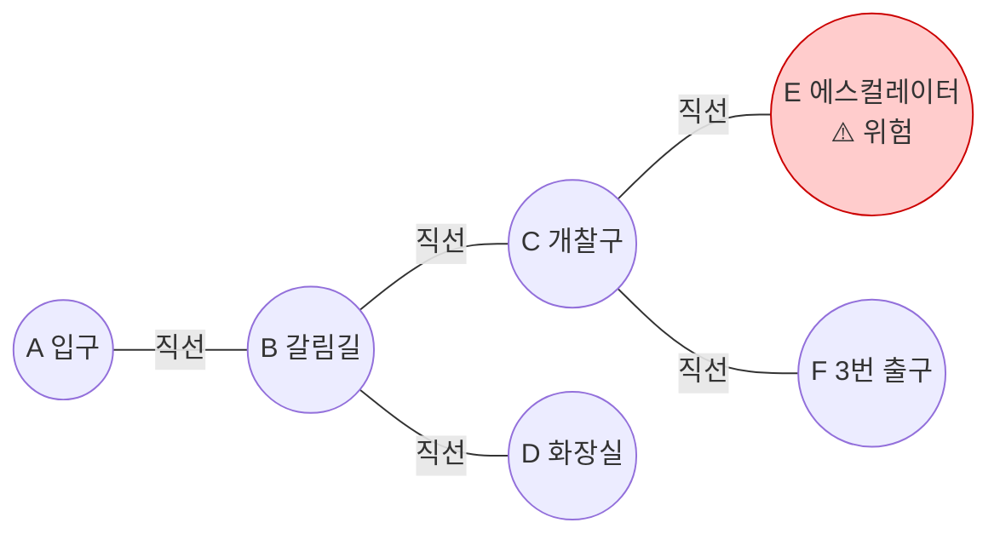
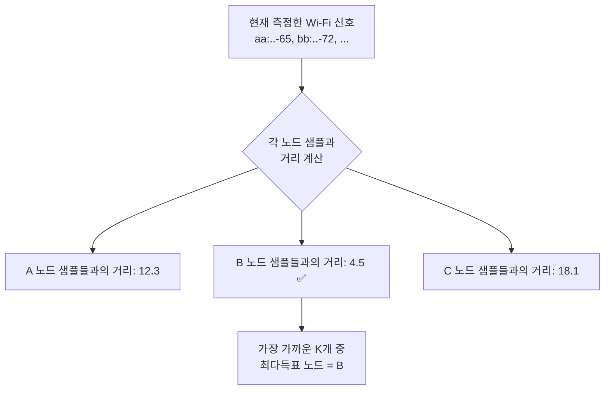
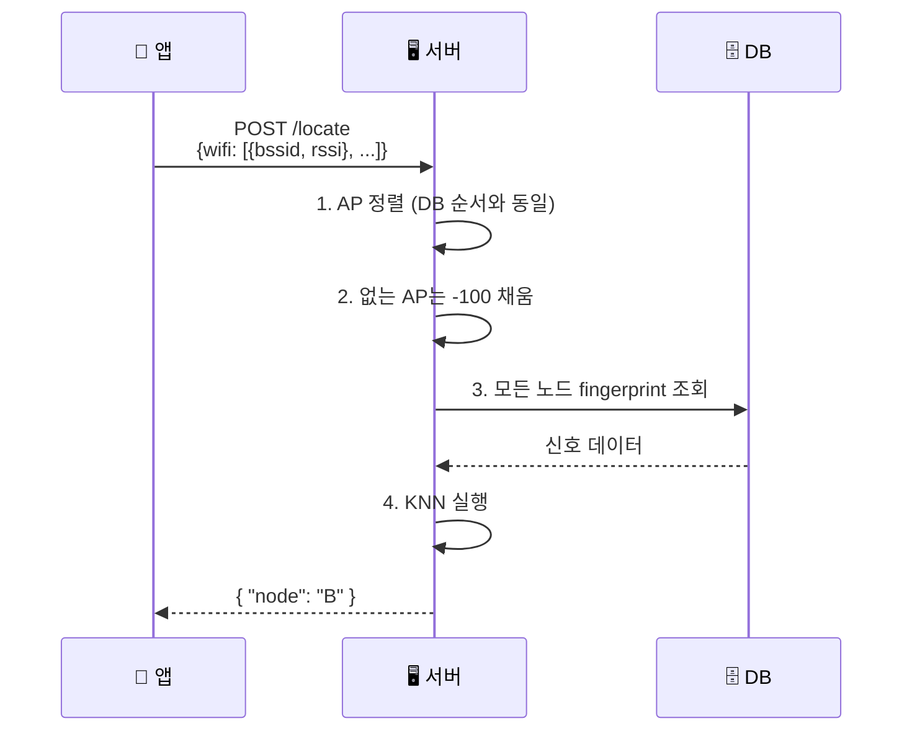
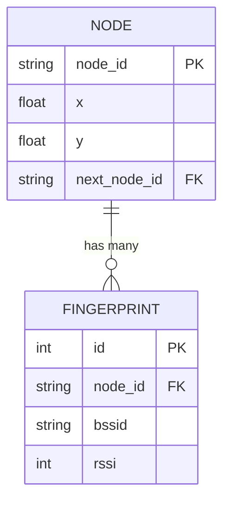
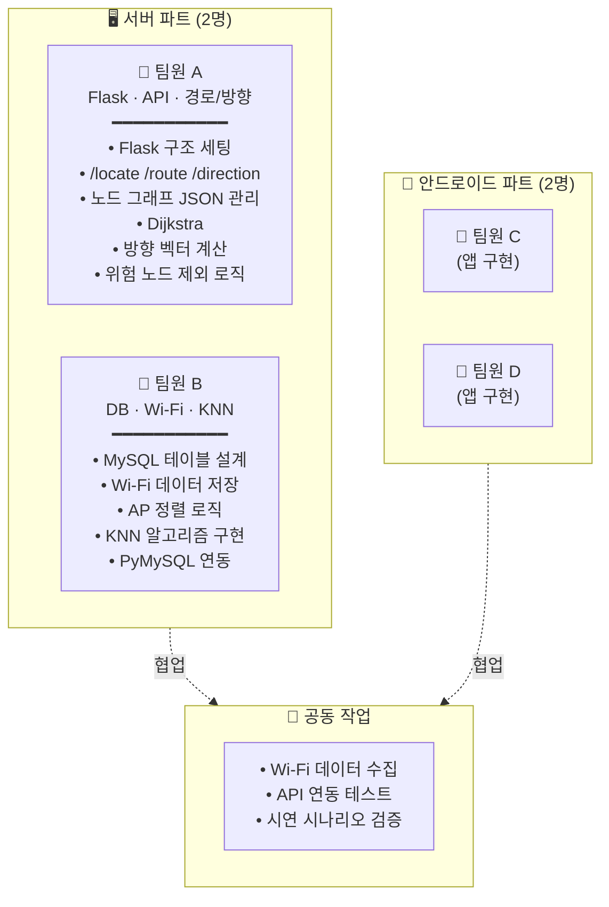
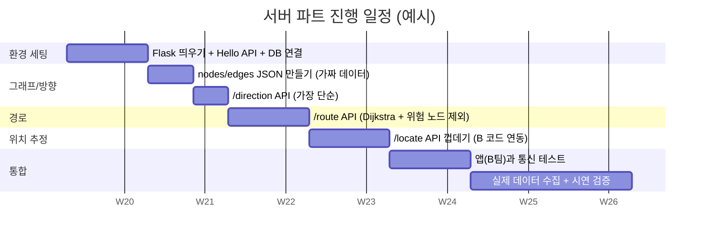

# 지하철역 보행지원 스마트폰 어플리케이션 — 서버

> 시각장애인이 지하철역 안에서 안전하게 길을 찾을 수 있도록, Wi-Fi 신호로 위치를 추정하고 진동·음성으로 방향을 안내하는 시스템의 **서버 파트** 저장소입니다.

졸업프로젝트 (아주대학교 우당탕탕 팀, 2026)

---

## 📋 목차

- [Quick Start (실행 방법)](#-quick-start-실행-방법)
- [테스트](#-테스트)
- [Swagger UI](#-swagger-ui)
- [프로젝트 한 줄 요약](#-프로젝트-한-줄-요약)
- [전체 시스템 구조](#-전체-시스템-구조)
- [동작 흐름 (사용 시나리오)](#-동작-흐름-사용-시나리오)
- [핵심 기술 개념](#-핵심-기술-개념)
- [API 명세](#-api-명세)
- [서버 폴더 구조](#-서버-폴더-구조)
- [팀 역할 분담](#-팀-역할-분담)
- [구현 우선순위 (성능보다 완성)](#️-구현-우선순위-성능보다-완성)
- [추천 진행 순서](#️-추천-진행-순서)
- [결정이 필요한 항목](#-결정이-필요한-항목)

---

## 🚀 Quick Start (실행 방법)

```bash
git clone https://github.com/ajou-udangtangtang/subway-navigation-server.git
cd subway-navigation-server

python3 -m venv .venv
source .venv/bin/activate          # Windows: .venv\Scripts\activate
pip install -r requirements.txt

cp .env.example .env               # DB 자격증명 등 수정 (Team B 영역)
python app.py
```

서버는 `http://localhost:5000` 에서 응답합니다.

```bash
# 스모크 테스트
curl -X POST http://localhost:5000/direction \
  -H "Content-Type: application/json" \
  -d '{"from":"station_exit","to":"floor1_hall"}'
# → {"angle": 268, "cardinal": "W", "clock": 9}

curl -X POST http://localhost:5000/route \
  -H "Content-Type: application/json" \
  -d '{"from":"station_exit","to":"down_platform"}'
# → {"path":[{"node":"station_exit", "floor":"ground", ...}, ..., {"node":"down_platform", ...}]}
```

> **주의**: `/locate` 는 Team B의 KNN 모듈이 등록되기 전까지 `KNN_ERROR` (500) 을 반환합니다 — 의도된 동작입니다.

---

## 🧪 테스트

```bash
pytest tests/unit tests/integration -q  # 빠른 로컬 (MySQL X, 브라우저 X)
pytest tests/e2e -v                     # E2E (실서버 subprocess + Playwright Chromium)
pytest                                  # 전체 약 72 테스트
```

단위/통합 테스트는 **MySQL이 필요 없습니다** — `TestConfig` 격리 + `fake_estimator` fixture로 KNN 호출 차단.

E2E 테스트는 첫 실행 전 한 번:
```bash
playwright install chromium   # ~150MB, 1회만
```

---

## 📖 Swagger UI

서버 실행 후 브라우저로 접속:

- Swagger UI: **http://localhost:5000/apidocs**
- OpenAPI JSON: http://localhost:5000/apispec_1.json (Postman 등으로 import 가능)

`docs/05-API명세.md` 가 source of truth이며, Swagger spec 은 그 미러링입니다. 변경 시 docs 먼저 수정 후 endpoint docstring 동기화.

---

## 🎯 프로젝트 한 줄 요약

**"지하철역 안 보이는 사람용 내비게이션"**

차량 내비게이션과 같은 개념입니다.

| | 차량 내비 | 본 프로젝트 |
|---|---|---|
| 위치 인식 | GPS | **Wi-Fi Fingerprinting + KNN** |
| 길찾기 | 도로 지도 | **노드 그래프 + Dijkstra** |
| 안내 방식 | 화면/음성 | **진동 + 음성 (TalkBack)** |

---

## 🏗 전체 시스템 구조



**역할을 단순하게:**
- **앱**: 센서 모으는 사람 + 사용자에게 알려주는 사람
- **서버**: 모든 계산 담당하는 두뇌
- **DB**: Wi-Fi 신호와 노드 정보 저장소

---

## 🚶 동작 흐름 (사용 시나리오)

### 전체 시퀀스



### 단계별 상태 다이어그램



---

## 🧠 핵심 기술 개념

### 1. 노드(Node)란?

지하철역 안에서 **갈림길이 발생하는 모든 지점**.
사용자가 "다음에 어디로 갈까?"를 결정해야 하는 위치들입니다.

> **약속**: 노드 사이는 **무조건 직선 통로**.
> 그래야 "벡터 한 개"로 방향 안내가 가능합니다.



### 2. 왜 GPS 안 쓰고 Wi-Fi?

지하라서 **GPS가 안 잡힙니다**. 대신 지하철역 내부 Wi-Fi AP들의 신호 세기는 위치마다 다르게 측정되기 때문에, 그 패턴으로 "여기가 어디인지" 추측합니다. 이걸 **Wi-Fi Fingerprinting**이라 합니다.

### 3. KNN 알고리즘

> **"지금 보이는 Wi-Fi 신호 패턴이 DB에 저장된 어느 노드의 패턴과 제일 비슷해?"**

단순한 거리 비교 알고리즘입니다.



### 4. 방향 안내 — 벡터 + 나침반

서버는 **현재 노드 → 다음 노드의 절대 각도**를 알려줍니다.
앱은 **나침반과 비교**해서 사용자가 어느 정도 빗나가 있는지 계산합니다.

| 정확한 방향과의 차이 | 진동 패턴 |
|---|---|
| ±60° ~ ±30° | 초당 1회 약한 진동 |
| ±30° ~ ±15° | 초당 2회 약한 진동 |
| ±15° 이내 | (정확한 방향) |

---

## 🔌 API 명세

### `/locate` — "나 지금 어디야?"



**요청**
```json
POST /locate
{
  "wifi": [
    {"bssid": "aa:bb:cc:dd:ee:ff", "rssi": -65},
    {"bssid": "11:22:33:44:55:66", "rssi": -72}
  ]
}
```

**응답**
```json
{ "node": "B" }
```

---

### `/route` — "여기서 거기까지 어떻게 가?"

**요청**
```json
POST /route
{ "from": "A", "to": "F" }
```

**응답**
```json
{ "path": ["A", "B", "C", "D", "F"] }
```

> ⚠️ **위험 노드(에스컬레이터 등)는 자동으로 제외**됩니다.
> 위험 노드를 목적지로 지정하면 에러를 반환합니다.

---

### `/direction` — "지금 어느 쪽으로 가야 해?"

**요청**
```json
POST /direction
{ "from": "A", "to": "B" }
```

**응답**
```json
{ "angle": 90 }
```

> 두 노드의 좌표를 사용해 `atan2`로 절대 각도를 계산합니다.

---

## 📦 서버 폴더 구조

```
subway-navigation-server/
├── app.py              # Flask 시작점, API 3개 정의
├── config.py           # DB 접속 정보
├── graph.py            # 그래프 JSON 로드, Dijkstra
├── direction.py        # 두 노드 좌표로 각도 계산
├── knn.py              # (팀원 B 담당, 우리는 import만)
├── data/
│   ├── nodes.json      # {"A": {"x":0,"y":0}, ...}
│   ├── edges.json      # {"A": ["B"], "B": ["A","C"], ...}
│   └── danger.json     # ["E"]  (위험 노드 목록)
├── requirements.txt
└── README.md
```

**핵심**: 파일 5~6개로 끝나는 작은 프로젝트입니다.

---

## 🗄 데이터 모델

### MySQL 스키마



### 그래프 JSON 형식

```json
// nodes.json — 좌표
{
  "A": {"x": 0, "y": 0},
  "B": {"x": 5, "y": 0},
  "C": {"x": 5, "y": 5}
}

// edges.json — 연결 정보
{
  "A": ["B"],
  "B": ["A", "C"],
  "C": ["B"]
}

// danger.json — 위험 노드
["E"]
```

---

## 👥 팀 역할 분담



### 팀원 A ↔ B 인터페이스 포인트

| 영역 | A 담당 | B 담당 | 합의 필요 |
|---|---|---|---|
| `/locate` | API 라우팅 / 입출력 | KNN 알고리즘 | 입력 JSON 형식, AP 정렬 규칙 |
| 노드 ID | 그래프 JSON | DB 스키마 | **노드 ID 체계 통일 필수** |
| Wi-Fi 데이터 | (불사용) | 정렬·-100 채우기 | DB 컬럼 순서 |

---

## ✂️ 구현 우선순위 (성능보다 완성)

> **이 프로젝트의 목표는 "동작하는 앱 완성"입니다.**
> 과도한 최적화나 확장성 고민은 일단 배제합니다.

| 문서 요구사항 | 처음에는 이렇게 단순화 |
|---|---|
| "3초간 측정 후 다수결" | → **1번만** 측정해서 결과 반환. 정 안되면 나중에 추가 |
| "AP 정렬 정교하게" | → **BSSID 알파벳순** 정렬. 그 이상 X |
| "Dijkstra 최적화" | → Python `heapq`로 그대로 구현. 노드 수십 개라 충분히 빠름 |
| "위험 노드 별도 테이블" | → **`danger.json` 텍스트 파일 하나**. 끝 |
| "DB에 그래프 저장" | → **JSON 파일**에 두고 서버 시작할 때 한 번만 읽기 |
| 사용자 인증/세션 | → **아예 만들지 않기**. 문서에도 없음 |

> ⚠️ **흔한 함정**: 처음부터 "확장 가능한 구조"를 만들려다 시간 다 씀.
> 일단 하드코딩으로라도 끝까지 동작시키고, 그 다음에 정리하기.

---

## 🛣️ 추천 진행 순서



| 주차 | 할 일 |
|---|---|
| Week 1 | Flask 띄우기 + Hello World API + DB 연결 확인 *(이게 안되면 아무것도 안됨)* |
| Week 2 | `nodes.json`, `edges.json` 만들기 (가짜 데이터 5~6개) + `/direction` API |
| Week 3 | `/route` API (Dijkstra + 위험 노드 제외) |
| Week 4 | `/locate` API 껍데기 (KNN은 팀 B 결과 받아서 끼우기) |
| Week 5 | 앱(팀 B)과 통신 테스트 |
| Week 6+ | 실제 지하철역 데이터 수집 → 시연 시나리오 검증 |

---

## ❓ 결정이 필요한 항목

문서를 보면 아직 안 정해진 것들이 있습니다. 시작 전에 팀과 정리하면 좋습니다.

- [ ] **위험 노드 정보 형식** — JSON에 `"danger": true` 같은 필드 추가할지 (문서에 "추가 필요?"로 남아있음)
- [ ] **3초간 측정 결과 처리 위치** — 앱에서 누적 후 1회 전송 vs 서버에서 다수결
- [ ] **`/locate`가 위치만 반환할지, 경로 안내 상태도 같이 반환할지**
- [ ] **`next_node_id` 단일값 구조** — node 테이블 스키마가 next_node_id 단일 컬럼인데, 갈림길(2방향 이상)이 노드 정의 자체라 그래프 구조와 불일치. **별도 edge 테이블이 자연스러움**
- [ ] **노드 ID 명명 규칙** — A, B, C... vs `gate-1`, `stairs-2`... (앱 UI에 노출될 수도 있음)

---

## 🛠 기술 스택

- **언어**: Python 3.x
- **웹 프레임워크**: Flask
- **DB**: MySQL + PyMySQL
- **위치 추정**: KNN (scikit-learn 또는 직접 구현)
- **앱 통신**: HTTP POST (Retrofit 라이브러리 사용 — 앱쪽)

---

## 📚 참고 — 원본 요구사항 출처

이 문서는 졸업프로젝트 요구사항 명세서 *"지하철역 보행지원 스마트폰 어플리케이션"*을 분석하여 서버 파트 관점에서 재정리한 내용입니다.
