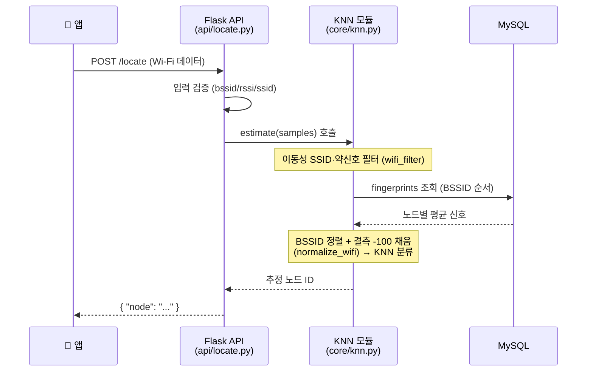
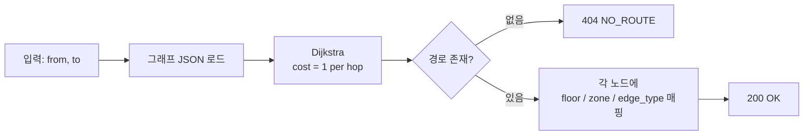

# 05. API 명세

## 5.1 API 개요

### 5.1.1 공통 사양

| 항목 | 값 |
|---|---|
| 프로토콜 | HTTP/1.1 |
| 메서드 | POST |
| Base URL | `http://<server-host>:<port>` *(개발 환경에서 결정)* |
| Content-Type | `application/json; charset=utf-8` |
| 응답 인코딩 | UTF-8 JSON |
| 인증 | 없음 *(요구사항 명세서에 명시 없음)* |

### 5.1.2 엔드포인트 목록

| # | Endpoint | 기능 | 호출 주체 |
|---|---|---|---|
| 1 | `POST /locate` | 현재 위치 추정 | 앱 (3~5초 주기) |
| 2 | `POST /route` | 경로 탐색 | 앱 (목적지 선택 시 1회) |
| 3 | `POST /direction` | 노드 간 절대 방향 산출 | 앱 (각 노드 진입 시) |

### 5.1.3 공통 응답 규약

성공 시 HTTP `200 OK` 와 함께 결과 JSON을 반환한다. 오류 시 HTTP `4xx` 또는 `5xx` 상태코드와 함께 다음 형식의 본문을 반환한다.

```json
{
  "error": {
    "code": "INVALID_NODE",
    "message": "Unknown node id: 'Z'"
  }
}
```

---

## 5.2 `POST /locate` — 현 위치 확인

### 5.2.1 기능 설명

앱이 측정한 Wi-Fi AP 신호 데이터를 입력받아, KNN 알고리즘을 통해 가장 유사한 신호 패턴을 가진 노드 ID를 반환한다.

### 5.2.2 처리 순서



> **책임 주체 주의**: 입력 검증은 API 레이어(`api/locate.py`), **BSSID 정렬·결측 -100 채움·SSID 필터·DB 조회·KNN 분류는 모두 KNN 모듈(`core/knn.py`, 팀 B)** 안에서 일어난다. API 는 `estimate()` 호출만 한다.

### 5.2.3 요청 (Request)

```http
POST /locate HTTP/1.1
Content-Type: application/json
```

```json
{
  "wifi": [
    { "bssid": "aa:bb:cc:dd:ee:ff", "rssi": -65 },
    { "bssid": "11:22:33:44:55:66", "rssi": -72 },
    { "bssid": "77:88:99:aa:bb:cc", "rssi": -88 }
  ]
}
```

| 필드 | 타입 | 필수 | 설명 |
|---|---|---|---|
| `wifi` | array | ✓ | 측정된 AP 목록 |
| `wifi[].bssid` | string | ✓ | AP의 MAC 주소 |
| `wifi[].rssi` | number | ✓ | 신호 세기 (dBm 단위, 음수). **int·float 모두 허용** — 앱이 최근 N개 평균을 보내면 float 가 될 수 있어 서버가 둘 다 수용 |
| `wifi[].ssid` | string | ✗ | AP 이름 (선택). 보내면 **서버측 이동성 기기 SSID 필터**가 활성화됨 (`iPhone`, `[dryer]` 등 제거). 앱이 이미 필터링했어도 2차 안전망으로 권장 |

### 5.2.4 응답 (Response)

```http
HTTP/1.1 200 OK
Content-Type: application/json
```

```json
{
  "node": "down_platform"
}
```

| 필드 | 타입 | 설명 |
|---|---|---|
| `node` | string | KNN으로 추정된 노드 ID (예: `station_exit`, `down_platform` 등 의미 ID) |

### 5.2.5 오류 응답

| HTTP Status | 코드 | 발생 조건 |
|---|---|---|
| 400 | `INVALID_PAYLOAD` | `wifi` 배열이 누락되었거나 형식이 올바르지 않음 |
| 400 | `EMPTY_WIFI` | `wifi` 배열이 비어있음 |
| 500 | `KNN_ERROR` | KNN 모듈 실행 중 내부 오류 |

---

## 5.3 `POST /route` — 경로 탐색

### 5.3.1 기능 설명

출발 노드와 목적지 노드를 입력받아 **hop 수 최소 경로**를 산출. 각 노드에는 `floor`, `zone`, `edge_to_next` 메타데이터가 포함된다.

> **변경 이력 (2026-05-21)**: 좌표 기반 유클리드 비용 → hop 수 비용으로 단순화. 위험 노드 회피 로직 제거 (`edge_type` 으로 대체).

### 5.3.2 처리 순서



### 5.3.3 요청 (Request)

```json
{
  "from": "station_exit",
  "to": "down_platform"
}
```

| 필드 | 타입 | 필수 | 설명 |
|---|---|---|---|
| `from` | string | ✓ | 출발 노드 ID (location) |
| `to` | string | ✓ | 목적지 노드 ID |

### 5.3.4 응답 (Response)

```json
{
  "path": [
    { "node": "station_exit",        "floor": "ground", "zone": "entrance", "edge_to_next": "flat" },
    { "node": "floor1_hall",         "floor": "1F",     "zone": "hall",     "edge_to_next": "flat" },
    { "node": "fare_gate",           "floor": "1F",     "zone": "gate",     "edge_to_next": "flat" },
    { "node": "floor1_stairs",       "floor": "1F",     "zone": "stairs",   "edge_to_next": "stairs" },
    { "node": "stairs_mid",          "floor": "mid",    "zone": "stairs",   "edge_to_next": "stairs" },
    { "node": "b1_stairs",           "floor": "B1",     "zone": "stairs",   "edge_to_next": "flat" },
    { "node": "b1_elevator",         "floor": "B1",     "zone": "hall",     "edge_to_next": "flat" },
    { "node": "b1_down_stairs_front","floor": "B1",     "zone": "branch",   "edge_to_next": "branch" },
    { "node": "down_platform",       "floor": "B1",     "zone": "platform", "edge_to_next": null }
  ]
}
```

| 필드 | 타입 | 설명 |
|---|---|---|
| `path` | array&lt;object&gt; | 출발지 → 목적지 순서 |
| `path[].node` | string | 노드 ID |
| `path[].floor` | string | 층 (ground / 1F / mid / B1) |
| `path[].zone` | string | 구역 종류 (entrance / hall / gate / stairs / branch / platform) |
| `path[].edge_to_next` | string \| null | 다음 노드로의 이동 형태 (`flat`/`stairs`/`branch`). 마지막 노드는 `null` |

### 5.3.5 오류 응답

| HTTP Status | 코드 | 발생 조건 |
|---|---|---|
| 400 | `INVALID_PAYLOAD` | `from` 또는 `to` 누락 |
| 400 | `INVALID_NODE` | `from` 또는 `to` 가 그래프에 존재하지 않음 |
| 404 | `NO_ROUTE` | 도달 가능한 경로가 없음 |

> ⚠️ `DANGER_DESTINATION` 에러 코드는 폐기되었다 (2026-05-21).

---

## 5.4 `POST /direction` — 방향 안내

### 5.4.1 기능 설명

두 노드 사이의 **사전 측정된 절대 방위각**을 반환한다. 박경찬님 현장 실측 데이터 (`node_directions`) 를 그대로 응답.

> **변경 이력 (2026-05-21)**: `atan2` 좌표 계산 → DB/JSON 조회로 변경. 좌표(x, y) 시스템에서 제거됨.

### 5.4.2 처리 순서

1. 입력 검증
2. 그래프 JSON 의 `node_directions` 에서 `(from, to)` 키로 조회
3. 미존재 시 `NOT_CONNECTED` 반환 (인접 노드가 아님 의미)
4. 존재 시 `angle` + `cardinal` + `clock` 반환

### 5.4.3 요청 (Request)

```json
{
  "from": "station_exit",
  "to": "floor1_hall"
}
```

| 필드 | 타입 | 필수 | 설명 |
|---|---|---|---|
| `from` | string | ✓ | 현재 노드 ID (location) |
| `to` | string | ✓ | 다음 노드 ID — `from` 과 직접 연결되어 있어야 함 |

### 5.4.4 응답 (Response)

```json
{
  "angle": 268,
  "cardinal": "W",
  "clock": 9
}
```

| 필드 | 타입 | 설명 |
|---|---|---|
| `angle` | number | 절대 방위각 (0~360°, 정북=0°, 시계방향) |
| `cardinal` | string | 8방위 식별자 — `N` / `NE` / `E` / `SE` / `S` / `SW` / `W` / `NW` |
| `clock` | integer | 시계 방향 (1~12시) |

### 5.4.5 좌표계 정의

- **angle = 0°** = 정북, **시계방향 양수** → 동쪽 = 90°, 남쪽 = 180°, 서쪽 = 270°
- 폰의 자기센서(나침반) 좌표계와 일치하므로 앱은 차감만 하면 됨

### 5.4.6 오류 응답

| HTTP Status | 코드 | 발생 조건 |
|---|---|---|
| 400 | `INVALID_PAYLOAD` | `from` 또는 `to` 누락 |
| 400 | `INVALID_NODE` | `from` 또는 `to` 가 그래프에 존재하지 않음 |
| 400 | `NOT_CONNECTED` | `(from, to)` 쌍의 방위각 데이터 없음 (직접 연결되지 않음) |

---

## 5.5 공통 에러 응답 정책

### 5.5.1 에러 응답 형식

```json
{
  "error": {
    "code": "<오류 코드>",
    "message": "<사람이 읽을 수 있는 메시지>"
  }
}
```

### 5.5.2 에러 코드 목록 (전체)

| 코드 | HTTP Status | 의미 |
|---|---|---|
| `INVALID_PAYLOAD` | 400 | 요청 본문이 JSON이 아니거나 필수 필드 누락 |
| `EMPTY_WIFI` | 400 | `/locate` 요청에 Wi-Fi 데이터가 비어있음 |
| `INVALID_NODE` | 400 | 존재하지 않는 노드 ID |
| `NOT_CONNECTED` | 400 | 직접 연결되지 않은 두 노드의 방향 요청 |
| `NO_ROUTE` | 404 | 도달 가능한 경로 없음 |
| `NOT_FOUND` | 404 | 존재하지 않는 URL (잘못된 경로 호출) |
| `METHOD_NOT_ALLOWED` | 405 | 허용되지 않은 HTTP 메서드 (예: POST 엔드포인트에 GET) |
| `KNN_ERROR` | 500 | KNN 내부 오류 |
| `DB_ERROR` | 500 | 데이터베이스 접근 오류 |
| `INTERNAL_ERROR` | 500 | 그 외 서버 내부 오류 |

### 5.5.3 클라이언트 측 처리 가이드라인

- **400 계열**: 사용자 입력 오류 또는 클라이언트 버그. 앱에서 음성 안내 후 재시도 유도.
- **404 (`NO_ROUTE`)**: 다른 목적지를 선택하도록 사용자에게 안내.
- **500 계열**: 일시적 서버 오류 가능성. 일정 횟수 재시도 후 실패 시 사용자에게 안내.
