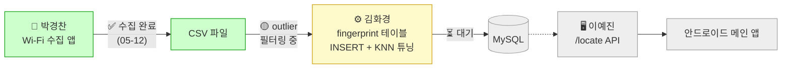

# 10. 진행 이력

> 본 문서는 팀 단톡방의 의사결정 기록을 바탕으로 프로젝트 시작(2026-03-13)부터 현 시점까지의 진행 경과를 정리한 자료입니다. 보고서의 *"개발 과정"* 또는 *"의사결정 흐름"* 섹션에 그대로 인용 가능합니다.
>
> **기준일**: 2026-05-17
> **출처**: 팀 단톡방 (2026-03-13 ~ 2026-05-12 기록 + 본인 개발 일지)

---

## 10.1 단계 요약

| Phase | 기간 | 주요 활동 | 산출물 |
|---|---|---|---|
| Phase 1 | 03-13 ~ 03-26 | 팀 구성, 개인 아이디어 제출, 후보 선정 | 아이디어 List.xlsx, 제안서 6건 |
| Phase 2 | 03-27 | **1차 교수님 미팅** (계획서 면담) | 교수님 피드백 회의록 |
| Phase 3 | 03-29 ~ 04-02 | 컨셉 확정 — 지하철 실내 네비게이션 | PPT 초안, 시연 시나리오 |
| Phase 4 | 04-03 | **계획서 발표 (마일스톤)** | 발표 PPT (1차) |
| Phase 5 | 04-06 ~ 04-16 | 기술 검증 — 비콘 사용 불가 확정, Wi-Fi Fingerprinting 단일 방향 결정 | 기술 검증 결과 |
| Phase 6 | 04-17 ~ 05-05 | 요구사항 재정의 + 분업 + Claude 도입 | 요구사항 docx, 역할 분담표 |
| Phase 7 | 05-09 ~ | **구현 단계** — 서버 scaffold 완료, 데이터 수집 진행 | GitHub repo, Flask 골격, 데이터 수집 앱 |

---

## 10.2 Phase 1 — 팀 구성 및 아이디어 탐색 (03-13 ~ 03-26)

### 03-13
- 팀 단톡방 개설. 박경찬(조장), 김화경, 이예진, 최수빈 4명.
- 각자 발표 아이디어 1건씩 제출 시작.

### 03-15 ~ 03-23
- 추가 아이디어 발굴 및 공유. 후보 약 6건 누적.
- 주요 후보: PM 사고 감지, 주차 위치 역추적, 졸음운전 햅틱, 분리수거 AI, 시청각장애인 햅틱 내비, 사각지대 보행자 알림, 유해조수 퇴치, 환기 시스템, 점자블록 단절 안내 등.

### 03-26
- 박경찬이 신규 아이디어 *"점자블록 단절 구간 유도 및 위치 안내 음향 시스템"* 제안.
- 팀 투표로 최종 **2건** 선정:
  1. 점자블록 단절 구간 안내 시스템 (햅틱)
  2. 우회전 사각지대 보행자 인지 시스템

---

## 10.3 Phase 2 — 1차 교수님 미팅 (03-27)

### 미팅 개요
- 6조 미팅 시간대: **19:30 ~ 20:00** (줌)
- 2건 모두 발표하여 피드백 수령

### 우회전 사각지대 시스템 — 사실상 거절
- 트럭 통행 도로 전체 설치는 **비용 현실성 부족**
- 반사경도 안 보는데 LED를 볼 것인가
- **차량(트럭) 부착형으로 좁히라**는 제안 (= 인프라형 폐기)

### 점자블록 시스템 — 긍정적 피드백 + 구체 가이드
| 피드백 | 영향 |
|---|---|
| 흰색 지팡이(화이트 완드)는 국제표준 | 기존 도구 존중 |
| 보도블록은 공공재 → 개인이 개조 불가 | **하드웨어 부착형 폐기** |
| 보도블록에서 소리 X → **리모컨 진동**으로 변경 | 안내 매체 확정 |
| 범위를 좁혀라 (지하철 2호선 1개역 정도) | **단일 역 시연** 결정 |
| 계단/에스컬레이터 감지 고려 | 위험 노드 개념 도입 |
| 방향 맞으면 진동 세게 / 아니면 약하게 | 진동 패턴 규칙 |
| **Wi-Fi (이미 구축된 인프라) 활용** | 위치 추정 기술 방향 |
| 시각장애인은 촉각 감각 뛰어남 | 미세 진동 활용 가능 |

→ 점자블록 아이디어로 **단일화 결정**.

---

## 10.4 Phase 3 — 컨셉 확정 (03-29 ~ 04-02)

### 03-29: 박경찬이 두 가지 세부 방향 제시
1. **시각장애인 지하철 네비게이션** — 입구에서 목적지(출구)까지 경로 안내
2. **지하철 내 보도블록 Finding** — 보도블록 끊긴 지점에서 다음 블록 안내

### 03-30: 만장일치로 **네비게이션** 방향 결정
- 운전 내비처럼 좌우회전·직진·계단/장애물 안내
- 사용자가 역 입구에서 앱 실행 → 목적지 설정 → 안내 시작

### 03-31 ~ 04-02: PPT 제작
- 김화경: PPT 초안 (미리캔버스) → 글씨 깨짐 방지로 이미지화
- 이예진: 개발계획서 작성
- 최수빈: 참고문헌 추가 (햅틱 ISO 표준 ISO9241-910/920/960)
- 이예진: Claude로 **시연 시나리오 2건 작성** (지하철 승차/하차)
- 박경찬: PPT 최종 수정

---

## 10.5 Phase 4 — 계획서 발표 (04-03, **마일스톤**)

- 6조 발표 (마지막 순서, 19:00 이후)
- 시점 시스템 구성:
  - ESP32 BLE 비콘 + 햅틱 리모컨 (별도 H/W)
  - React Native 앱
  - 백엔드 Dijkstra
- 교수님 피드백:
  - Wi-Fi 획득 가능성 검증 필요
  - 1m 이내 정확도 가능한지
  - 범용성 없는 웨어러블이면 화이트 완드에 설치 검토
  - 시연은 역사 내 영상 촬영

---

## 10.6 Phase 5 — 기술 검증 (04-06 ~ 04-16)

### 분담 (04-06)
- **박경찬**: Wi-Fi 패턴 차이 측정 테스트 (집과 가까운 광교중앙역)
- **최수빈**: 비콘 접근 가능성 조사
- **김화경**: 광교중앙역 평면도 확보
- **이예진**: 진동 패턴 초안

### 주요 발견
- **04-11**: 또타지하철 앱이 서울 1~4호선 역사에 9000개 비콘 설치·운용 중임을 최수빈이 확인
- **04-12**: 박경찬 — PC 기준 Wi-Fi 모듈과 폰 API가 달라 Raw data 차이 발생. **Wi-Fi Fingerprinting** 기법 발견
- **04-13**: 광교중앙역이 너무 커서 더 작은 역으로 변경 검토 (광교역, 도림천역 등 후보)
- **04-15**: 박경찬이 서울교통공사에 비콘 사용 허가 문의
- **04-16**: ❌ **비콘 사용 불가 회신** (또타지하철 관계자만 접근 허가)

### Phase 5 종료 시점 결정
**비콘 폐기 → Wi-Fi Fingerprinting + 스마트폰 자체 진동** 으로 시스템 단일화.
→ PPT의 H/W 구성(ESP32 비콘 + 햅틱 리모컨)이 사실상 폐기되는 출발점.

---

## 10.7 Phase 6 — 요구사항 재정의 및 분업 (04-17 ~ 05-05)

### 04-17 ~ 04-29: 요구사항 정리 + Claude 도입
- 박경찬이 프로젝트 목표 기능과 요구사항을 문서로 정리하기 시작.
- 04-21 ~ 04-29: **Claude MAX 학교 지원금 신청** (인당 20만원, 2개월). 계정 공유 사용.
- 04-28: 박경찬이 핵심 아키텍처 정리 — *"노드/링크 그래프 구조 + Wi-Fi Fingerprinting + 스마트폰 나침반"*

### 05-03: 요구사항 docx 공유
- 박경찬이 *"지하철역 보행지원 스마트폰 어플리케이션.docx"* 공유.
- 팀즈 공간 개설하여 명세 + 수집 데이터 통합 관리 시작.

### 05-05: 줌 미팅 — 역할 분담 확정
- **완성 목표일**: 5월 말 (최종 발표 6월 12일 역산)
- **이예진 → 팀원 A** (Flask + API + 경로·방향 로직)
- **김화경 → 팀원 B** (DB + Wi-Fi 처리 + KNN)
- 박경찬: 데이터 수집 + 안드로이드 보조 도구 자체 제작
- 최수빈: (역할 명시 미확인, 안드로이드 앱 추정)

---

## 10.8 Phase 7 — 구현 단계 (05-09 ~ 현재)

### 05-09 (이예진)
- GitHub Organization 생성: `ajou-udangtangtang`
- 서버 repo 생성: `subway-navigation-server` (Public)
- 프로젝트 분석 문서 + Mermaid 다이어그램 README 작성
- `docs/` 폴더에 보고서용 9개 문서 작성 (01~09)
  → 본 문서가 **10번째**로 추가됨

### 05-10 (박경찬)
- Wi-Fi RSSI 측정 → CSV 추출 **안드로이드 데이터 수집 앱** 자체 제작
- "빠르면 내일 위치별 확인해서 전달드릴 수 있을 것 같습니다"

### 05-10 (이예진) — 서버 scaffold 완료
- Flask 앱 팩토리 + 3개 API 엔드포인트 구현
  - `POST /locate` — 위치 추정 (Team B KNN 끼울 자리)
  - `POST /route` — Dijkstra + 위험 노드 회피
  - `POST /direction` — atan2 기반 절대 각도
- Team B 통합 경계 (`core/locator.py`) — module-level callable + `register_estimator()`
- 단위 테스트 29개 + 통합 테스트 19개 = **48 tests, all green**
- Swagger UI (`flasgger`) `/apidocs`
- `CLAUDE.md`, `worklog/` 시스템 구축
- 좌표계 변환 버그 수정 (Swagger 2.0 spec 호환)

### 05-12 (박경찬)
- 위치마다 데이터 수집 완료
- AP가 위치당 **최대 90개씩** 잡혀서 **이상치(outlier) 필터링** 가능성 확인 중
- 정리되면 화경(B)에게 전달 예정

### 05-13 ~ 현재
- 박경찬: outlier 필터링 + 데이터 정제 작업 진행 중
- 화경(B): 데이터 수신 대기 (수신 후 fingerprint 테이블 INSERT + KNN 튜닝)
- 이예진(A): 서버 scaffold 완료 상태에서 화경의 KNN 연동 대기

---

## 10.9 주요 의사결정 이력 (변경점 한눈에)

| 일자 | 의사결정 | 사유 |
|---|---|---|
| 03-26 | 점자블록 + 우회전 사각지대 2건 선정 | 후보군에서 투표 |
| 03-27 | 우회전 사실상 폐기, 점자블록 단일화 | 교수님 피드백 (비용·실효성) |
| 03-27 | 보도블록 H/W 부착 폐기 → 리모컨 진동 | 교수님 피드백 (공공재 보호) |
| 03-30 | 보도블록 Finding → 지하철 네비게이션 | 팀 만장일치 |
| 04-03 | 계획서 발표 (ESP32 비콘 + 햅틱 리모컨 + RN) | 발표용 구성 |
| 04-16 | **비콘 사용 폐기** | 서울교통공사 허가 불가 |
| 04-28 | 노드/링크 그래프 + Wi-Fi Fingerprinting + 스마트폰 나침반 단일 구성 | 비콘 없이도 위치 추정 가능 |
| 05-03 | 안드로이드 네이티브 + Flask 백엔드 + MySQL/KNN 확정 (docx) | 박경찬 요구사항 정리 |
| 05-05 | 역할: A=이예진(Flask), B=김화경(KNN/DB) | 분업 미팅 |
| 05-09 | GitHub Org/repo 개설 + 문서 9건 작성 | 코드 관리 시작 |
| 05-10 | 서버 scaffold + 48 tests 통과 | A 1차 완료 |
| 05-10 | Wi-Fi 수집 앱 (Android, CSV 추출) 자체 제작 | 데이터 수집 자동화 |
| **05-22** | **교수님 중간 미팅 예정** (PPT 일정 5/15에서 변경) | 학교 공지 |

---

## 10.10 일정 변경 사항

PPT 계획서 발표 시 일정은 **5/15 중간 미팅**이었으나, 학교 공지에 따라 **5/22로 변경**됨 (출처: 단톡방 05-07 공지).

| 마일스톤 | PPT 계획 | 실제 |
|---|---|---|
| 계획서 발표 | 04-03 | ✅ 04-03 |
| 교수님 중간 미팅 | 05-15 | **05-22 (변경)** |
| 현장 테스트 + 오차 보정 | 05-22 ~ 06-05 | 동일 |
| 버그 수정 + 발표 준비 | 06-05 ~ 06-12 | 동일 |
| 최종 발표 | 06-12 | 동일 |
| 최종 결과물 제출 | 06-19 | 동일 |

---

## 10.11 데이터 파이프라인 현황 (05-17 기준)

**현재 병목**: 박경찬의 outlier 필터링 완료 → 김화경에게 데이터 전달까지가 다음 임계 작업.
이게 풀려야 KNN 튜닝 → `/locate` 실연결 → 전체 파이프라인 가동.

---

## 10.12 본 문서의 갱신 정책

- 본 문서는 **시간순 누적 기록**이며 *retrospective* 자료입니다.
- 새로운 의사결정·마일스톤 도달 시 §10.1 표와 해당 Phase에 항목 추가.
- 일별 개발 작업 진행은 `worklog/` 폴더의 일지로 관리 (역할 분리).
