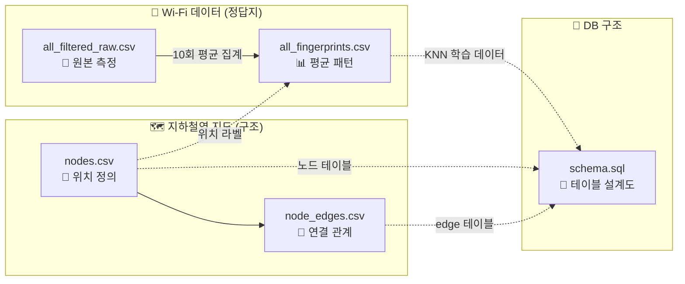
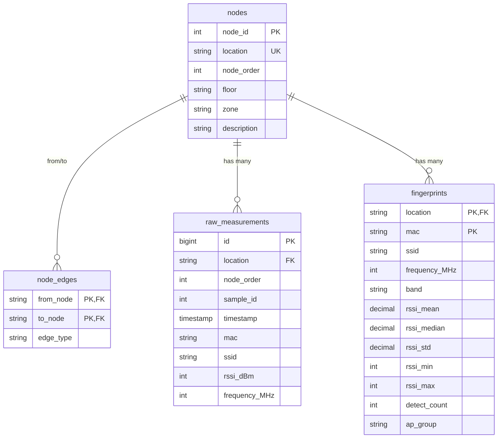

# 11. 수집 데이터 구조

> 본 문서는 2026-05-17 박경찬(조장)이 팀에 전달한 **5개 데이터 파일**의 구조 및 역할을 정리한 자료입니다. 보고서의 *"데이터 수집·구축"* 또는 *"DB 설계"* 섹션에 그대로 인용 가능합니다.
>
> **전달 일자**: 2026-05-17
> **수집 위치**: 11곳 (단일 역사 내 주요 지점)
> **수집 방식**: 박경찬 자체 제작 안드로이드 앱 (Wi-Fi RSSI 스캔 → CSV 추출)
> **수집 횟수**: 노드당 10회 측정

---

## 11.1 전달 자료 한눈에

| # | 파일 | 크기 | 내용 한 줄 요약 |
|---|---|---:|---|
| 1 | `nodes.csv` | 583 B | 노드 11곳 정의 (location, floor, zone 등) |
| 2 | `node_edges.csv` | 704 B | 노드 간 인접 관계 (양방향, edge_type 포함) |
| 3 | `all_filtered_raw.csv` | 379 KB | 11곳 × 10회 측정의 원본 데이터 (이상치 필터 적용 후) |
| 4 | `all_fingerprints.csv` | 50 KB | 위치-MAC당 통계로 집계된 평균 패턴 (KNN 매칭용) |
| 5 | `schema.sql` | 2.2 KB | DB 스키마 (4개 테이블 정의) |

### 11.1.1 파일 간 관계도



---

## 11.2 `nodes.csv` — 노드 정의 (지도의 점)

### 11.2.1 목적

지하철역 평면도 상에서 **사용자가 거쳐갈 11개 위치** 를 정의한다.

### 11.2.2 컬럼 정의

| 컬럼 | 타입 | 설명 |
|---|---|---|
| `node_id` | INT | 노드 번호 (1~11) |
| `location` | VARCHAR(64) | 노드 식별자 — 코드에서 사용하는 ID. 예: `station_exit`, `fare_gate` |
| `node_order` | INT | 진입 순서 (출입구=1, 승강장=11) |
| `floor` | VARCHAR(16) | 층 정보 — `ground`, `1F`, `mid`(계단 중간), `B1` |
| `zone` | VARCHAR(32) | 위치 종류 — `entrance`, `gate`, `hall`, `stairs`, `platform`, `branch` |
| `description` | VARCHAR(255) | 사람용 한국어 설명 |

### 11.2.3 11개 노드 전체 목록

| node_id | location | floor | zone | description |
|---:|---|---|---|---|
| 1 | `station_exit` | ground | entrance | 역 지상 출입구 |
| 2 | `fare_gate` | 1F | gate | 개찰구 |
| 3 | `floor1_hall` | 1F | hall | 1층 홀 |
| 4 | `floor1_stairs` | 1F | stairs | 1층 계단 시작 |
| 5 | `stairs_mid` | mid | stairs | 층 사이 계단 중앙 |
| 6 | `b1_stairs` | B1 | stairs | 지하 계단 |
| 7 | `b1_elevator` | B1 | hall | 지하 엘리베이터 앞 |
| 8 | `b1_down_stairs_front` | B1 | branch | 지하 하행 계단 앞 (분기점) |
| 9 | `down_platform` | B1 | platform | 하행 승강장 |
| 10 | `b1_up_stairs_front` | B1 | stairs | 지하 상행 계단 앞 |
| 11 | `up_platform` | B1 | platform | 상행 승강장 |

> ⚠️ **변경 사항**: 본 문서 §6 (`docs/06-데이터모델.md`)에서는 노드 ID를 단순 알파벳(`A`, `B`, `C`)으로 가정했으나, 본 자료의 채택으로 **의미 ID(`station_exit` 등)로 확정**된다. docs §9.3.1 D-02 결정 항목이 해소됨.

---

## 11.3 `node_edges.csv` — 노드 간 연결 (지도의 선)

### 11.3.1 목적

두 노드가 **직접 연결**되어 있다는 정보를 표현한다. Dijkstra 경로 탐색의 기본 재료.

### 11.3.2 컬럼 정의

| 컬럼 | 타입 | 설명 |
|---|---|---|
| `from_node` | VARCHAR(64) | 출발 노드 (location 이름) |
| `to_node` | VARCHAR(64) | 도착 노드 (location 이름) |
| `edge_type` | VARCHAR(16) | 이동 형태 — `flat`(평지), `stairs`(계단), `branch`(갈림길) |

### 11.3.3 특징

- **양방향이 모두 명시됨**: `A→B` 가 있으면 `B→A` 도 별도 행으로 존재.
- 총 **21개 행** (= 무방향 그래프 기준 10.5쌍).
- `edge_type` 은 사용자 안내 시 *"여기는 계단입니다"* 같은 컨텍스트 메시지에 활용 가능.

### 11.3.4 본 프로젝트에서의 활용

| 기능 | 활용 방식 |
|---|---|
| `/route` (Dijkstra) | 인접성 정보 → 그래프 탐색 |
| `/route` 응답 보강 | edge_type 정보를 함께 반환하여 앱이 위험·안내 멘트 생성 |
| `/direction` | 별도 `direction_deg` 컬럼 추가 필요 *(11.7 합의 사항 참조)* |

---

## 11.4 `all_filtered_raw.csv` — 원본 측정 데이터 (보관용)

### 11.4.1 목적

박경찬이 실제 지하철역에 가서 스마트폰으로 측정한 **모든 Wi-Fi 스캔 결과**. 이상치만 필터링된 상태로 보관된다.

### 11.4.2 사전 적용된 필터링 규칙

- **RSSI ≥ -90 dBm** 인 신호만 보존 (그보다 약한 잡음 신호는 제거)
- **이동성 기기 SSID** 제외 — `[dryer]`, `iPhone` 등의 핫스팟·블루투스 잔여 신호 제거

### 11.4.3 컬럼 정의

| 컬럼 | 타입 | 설명 |
|---|---|---|
| `location` | VARCHAR(64) | 측정 위치 (노드 location) |
| `node_order` | INT | 노드 순서 (nodes.csv 와 동일) |
| `sample_id` | INT | 몇 번째 스캔인지 (1~10) |
| `timestamp` | TIMESTAMP | 측정 시각 (밀리초 단위) |
| `mac` | VARCHAR(17) | AP MAC 주소 |
| `ssid` | VARCHAR(64) | AP 이름 (예: `Korail_WiFi_Free`) |
| `rssi_dBm` | INT | 신호 세기 |
| `frequency_MHz` | INT | 주파수 (2.4GHz 대역 = 2400대, 5GHz 대역 = 5000대) |

### 11.4.4 KNN에서 raw를 직접 쓰지 않는 이유

raw 데이터는 매 측정마다 RSSI 값이 -45, -47, -50, -48… 처럼 흔들린다 (노이즈).
이걸 그대로 비교하면 KNN 결과가 흔들려서 위치 추정 안정성이 떨어진다.

→ **§11.5 평균 패턴(fingerprints)** 으로 집계해서 비교하는 것이 표준.

### 11.4.5 raw 파일의 용도

- DB `raw_measurements` 테이블에 보관 → 추후 재집계 가능
- 데이터 출처 증빙 (어떻게 집계했는지의 근거)
- 시연 후 *"실제 측정 횟수"* 의 통계 자료

---

## 11.5 `all_fingerprints.csv` — 평균 패턴 (KNN 매칭의 핵심) ⭐

### 11.5.1 목적

각 노드에서 본 AP들의 **평균 신호 패턴**. KNN이 실제로 비교하는 데이터.

### 11.5.2 컬럼 정의

| 컬럼 | 타입 | 설명 |
|---|---|---|
| `location` | VARCHAR(64) | 노드 location |
| `mac` | VARCHAR(17) | AP MAC 주소 |
| `ssid` | VARCHAR(64) | AP 이름 |
| `frequency_MHz` | INT | 주파수 |
| `band` | VARCHAR(8) | `2.4GHz` / `5GHz` |
| **`rssi_mean`** | DECIMAL(6,2) | **10회 측정의 평균 (KNN 매칭에서 사용)** |
| `rssi_median` | DECIMAL(6,2) | 중앙값 |
| `rssi_std` | DECIMAL(6,2) | 표준편차 |
| `rssi_min` | INT | 최저값 |
| `rssi_max` | INT | 최고값 |
| `detect_count` | INT | 10회 중 몇 번 잡혔는지 |
| `ap_group` | VARCHAR(14) | 같은 물리 AP의 다중 MAC을 묶기 위한 그룹 키 (MAC 앞 5바이트) |

### 11.5.3 한 행 = (위치, AP) 한 쌍

PK 는 `(location, mac)` 조합이다.

예시:
```
location        | mac                 | ssid             | rssi_mean | detect_count
----------------+---------------------+------------------+-----------+--------------
station_exit    | 06:29:d5:5d:88:c1   | U+zone_2.4GHz    | -48.56    | 9
station_exit    | 06:29:d5:5d:88:c0   | Public WiFi Free | -49.20    | 10
station_exit    | 1e:bd:ad:13:cf:23   | Korail_WiFi_Free | -50.43    | 7
fare_gate       | aa:..               | ...              | -75.00    | 10
fare_gate       | bb:..               | ...              | -80.20    | 9
```

### 11.5.4 KNN 매칭 동작 방식

```
[앱 실시간 측정값]
  06:29:d5:5d:88:c1 → -47
  06:29:d5:5d:88:c0 → -48
  1e:bd:ad:13:cf:23 → -50

[fingerprints 테이블에서 각 location 별로 거리 계산]
  station_exit: 평균 [-48.56, -49.20, -50.43] → 유사도 매우 높음 ✅
  fare_gate   : 평균 [-75.00, -80.20, -65.00] → 유사도 낮음
  down_platform: 평균 [-90.10, -88.50, -92.00] → 유사도 매우 낮음

→ 결과: station_exit
```

### 11.5.5 본 프로젝트에서의 활용

| 측면 | 내용 |
|---|---|
| 학습 데이터 | KNN 의 reference set |
| 메모리 캐싱 대상 | `fingerprints` 테이블은 서버 기동 시 한 번 로드 후 메모리 보관 권장 |
| 갱신 시점 | 실측 데이터 재수집 시에만 갱신 (실시간 갱신 X) |

---

## 11.6 `schema.sql` — DB 스키마 설계도

### 11.6.1 목적

위 4개 CSV 파일을 어떤 형태로 DB에 저장할지의 청사진. **PostgreSQL 호환** 문법으로 작성됨 (`BIGSERIAL` 사용).

### 11.6.2 4개 테이블 구조



### 11.6.3 테이블별 역할

| 테이블 | 들어갈 CSV | 용도 |
|---|---|---|
| `nodes` | nodes.csv | 노드 11개 메타데이터 |
| `node_edges` | node_edges.csv | 인접 관계 (양방향) |
| `raw_measurements` | all_filtered_raw.csv | 원본 보관 (KNN에 직접 미사용) |
| `fingerprints` | all_fingerprints.csv | **KNN 매칭 핵심** (메모리 캐싱) |

### 11.6.4 인덱스 권장 사항 (스키마에 정의됨)

- `idx_nodes_location` — location 으로 노드 조회 가속
- `idx_edges_from` — Dijkstra 시 출발 노드 기반 인접 조회
- `idx_raw_location`, `idx_raw_mac` — raw 데이터 분석 시 사용
- `idx_fp_location`, `idx_fp_mac` — KNN 매칭 가속

---

## 11.7 본 프로젝트의 기존 구성과의 차이 / 합의 필요 사항

본 자료의 채택으로 docs §6 (`06-데이터모델.md`) 의 가정이 다음과 같이 변경된다.

| 항목 | 기존 docs §6 | 본 자료 채택 후 |
|---|---|---|
| 노드 ID 컨벤션 | 단순 알파벳 (`A`, `B`) | **의미 ID** (`station_exit`, `fare_gate`) |
| 컬럼 길이 | VARCHAR(16) | VARCHAR(64) |
| 노드 좌표 (x, y) | 존재 (atan2 계산용) | **없음** — 별도 합의 필요 *(§11.7.1)* |
| 그래프 저장 방식 | JSON 파일 | DB 테이블 + JSON 미러링 |
| Fingerprint 구조 | (node_id, bssid, rssi) raw | (location, mac, **mean/median/std/...**) 집계 |
| 위험 노드 개념 | `danger.json` 회피 | **사라짐** — edge_type 기반 안내로 전환 |

### 11.7.1 합의 필요 항목 — 노드 좌표 / 방향 정보

`nodes.csv` 에 (x, y) 좌표가 없으므로 `/direction` API 의 절대 각도 계산이 불가능하다. 다음 중 하나를 선택해야 한다.

| 옵션 | 내용 | 추가 작업 |
|---|---|---|
| (a) `nodes` 에 (x, y) 컬럼 추가 | 평면도 기준 임의 좌표 부여 | 11개 × 2 값 |
| (b) `node_edges` 에 `direction_deg` 컬럼 추가 | edge별 절대 각도 미리 저장 | 21개 × 1 값 |
| (c) 방향 안내 카테고리화 | "왼쪽/오른쪽/직진/계단 위" 형식 | docs/구현 전면 재작성 |

→ **(b) 안 권장**: 작업량이 적고 `/direction` 구현이 단순해진다 (계산 → 조회). docs §5.4 의 좌표계 규약(정북=0°, 시계방향) 그대로 적용 가능.

### 11.7.2 합의 필요 항목 — KNN 알고리즘 인터페이스

기존 `subway_server/core/locator.py` 의 `LocationEstimator = Callable[[list[WifiSample]], str]` 시그니처는 그대로 유효하다. 단, 내부 구현이 다음과 같이 변경된다.

| | 기존 docs 가정 | 본 자료 채택 후 |
|---|---|---|
| KNN 입력 | 앱이 보낸 단일 스캔 | 동일 (앱이 5초마다 1회 + 최근 3개 평균) |
| KNN 비교 대상 | 학습용 raw 샘플들 | **`fingerprints` 테이블의 rssi_mean** |
| 거리 계산 | 샘플별 거리 누적 | **평균 vs 측정값** 직접 거리 |

→ 김화경(팀원 B)이 구현 시 본 자료의 `fingerprints` 테이블을 메모리에 로드하여 매칭하면 된다.

---

## 11.8 본인(팀원 A) 작업 영향 범위

본 자료 도입으로 인해 갱신해야 할 본인 소스 코드 및 문서:

| # | 항목 | 영향 파일 |
|---|---|---|
| 1 | 노드 ID 컨벤션 의미 ID 로 전환 | `data/nodes.json`, `tests/fixtures/*.json` |
| 2 | 노드 좌표 제거 + edge에 direction 도입 | `data/*.json`, `core/graph.py`, `core/direction.py` |
| 3 | `/direction` 로직 변경 (계산 → 조회) | `subway_server/api/direction.py`, `tests/` |
| 4 | 위험 노드 코드 제거 | `data/danger.json` 폐기, `core/graph.py` dijkstra |
| 5 | `/route` 응답에 edge_type 포함 | `subway_server/api/route.py` |
| 6 | docs §5, §6, §9, §10 갱신 | `docs/` |
| 7 | CLAUDE.md 갱신 | `CLAUDE.md` |

→ §11.7.1 (a/b/c) 선택 후 일괄 작업.
